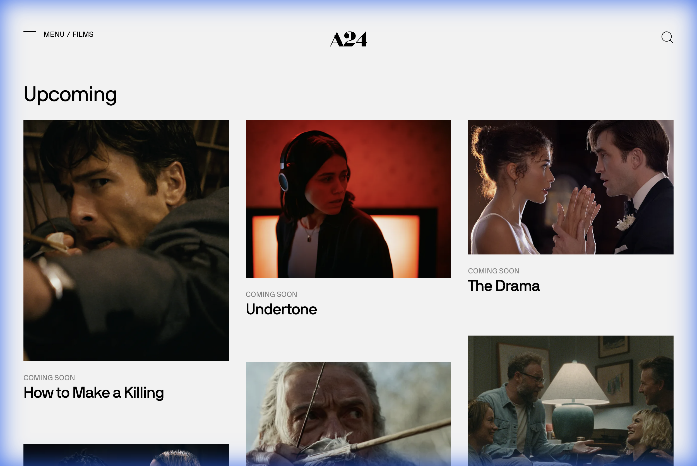
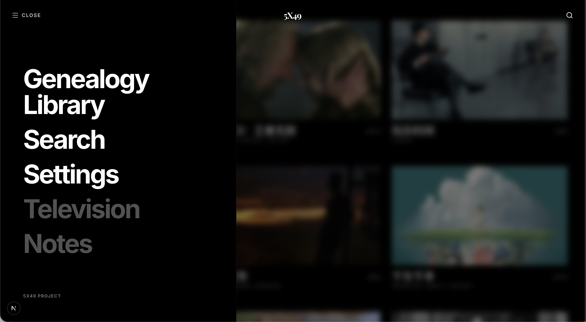
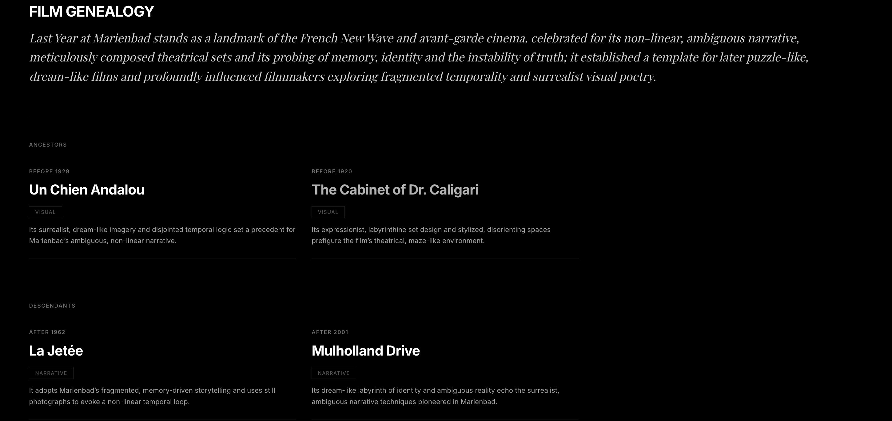
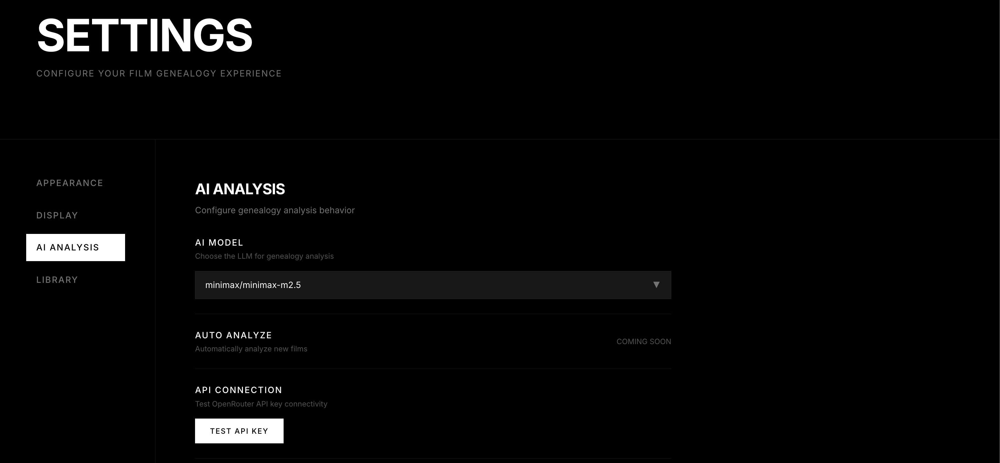

# 🎬 5X49

[English](README.md) | [简体中文](README.zh-CN.md)
> A modern, AI-powered film library manager with deep genealogy analysis and a premium A24-inspired aesthetic.



## ✨ Introduction

**5X49** is not just a media server; it's a cinematic exploration tool. Managing your local film collection has never been this beautiful. It scans your metadata, presents your films in a stunning dark-mode interface, and uses advanced AI to analyze the "genealogy" of films—connecting them by themes, directors, visual styles, and historical context.

## 🚀 Key Features

### 📚 Immersive Library
Automatically scans your local NFO-based collection (compatible with TinyMediaManager) and presents it in a responsive, visually rich grid.


### 🧠 AI-Powered Analysis
Deep dives into each film using Large Language Models (LLMs) to generate "genealogy reports," formatted in beautiful markdown. Explore connections you never knew existed.




### 📂 Easy Management
- **File Browser**: Select your media directory visually—no manual path typing required.
- **Manual Scan**: Trigger library updates on demand without restarting the server.


### 🐳 Docker Ready
Built for containerization from day one. Deploy easily with Docker Compose on any system.

## 🛠️ Tech Stack

- **Frontend**: Next.js 14, Tailwind CSS, Framer Motion
- **Backend**: FastAPI, SQLModel (SQLite), Pydantic
- **AI Integration**: OpenAI/OpenRouter API
- **Infrastructure**: Docker, Docker Compose

## 🏁 Getting Started (Docker)

The recommended way to run Film Genealogy is via Docker.

### 1. Requirements
- Docker & Docker Compose installed
- An API Key for OpenRouter (or OpenAI/Anthropic)

### 2. Quick Deploy
Save the following as `docker-compose.yml`:

```yaml
services:
  backend:
    image: alicolia/5x49-backend:latest
    ports:
      - "8000:8000"
    environment:
      - OPENROUTER_API_KEY=your_key_here
      - MEDIA_DIR=/media
    volumes:
      - ./data:/app/data
      - /path/to/your/movies:/media  # Map your local movie folder here

  frontend:
    image: alicolia/5x49-frontend:latest
    ports:
      - "3000:3000"
    depends_on:
      - backend
```

Run it:
```bash
docker-compose up -d
```

Access the app at [http://localhost:3000](http://localhost:3000).

## 💻 Local Development

If you want to contribute or modify the code:

### Backend
```bash
cd backend
python -m venv venv
source venv/bin/activate
pip install -r requirements.txt
python -m uvicorn app.main:app --reload
```

### Frontend
```bash
cd frontend
npm install
npm run dev
```

## ⚙️ Configuration

| Variable | Description | Default |
| :--- | :--- | :--- |
| `OPENROUTER_API_KEY` | API Key for LLM analysis | **Required** |
| `MEDIA_DIR` | Path to your movie collection (NFOs) | `/media` (Docker) |
| `API_BASE_URL` | LLM API Endpoint | `https://openrouter.ai/api/v1` |
| `ALLOWED_ORIGINS` | CORS allowed origins | `http://localhost:3000` |

---

*Crafted with 🖤 for film lovers.*
