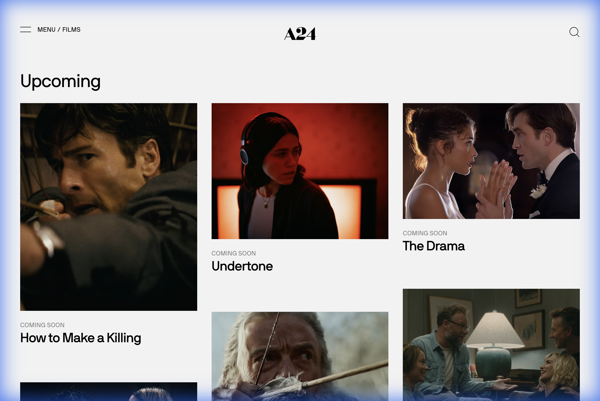

# 🎬 5X49

[English](README.md) | [简体中文](README.zh-CN.md)

> 面向本地电影收藏的资料库管理与电影谱系探索工具。



5X49 扫描本地电影文件夹和 NFO 元数据，以暗色电影化界面呈现收藏；可选的
TMDB 集成用于补全元数据与图片，可选的 OpenRouter 集成用于生成电影谱系分析。

## 功能概览

- 扫描 TinyMediaManager/Kodi 风格的电影目录和 NFO。
- 管理影片版本、观看状态、收藏、元数据与图片。
- 监听媒体目录并运行可追踪的后台扫描、整理和刮削工作流。
- 使用可选的大语言模型分析主题、风格与电影史关系。
- 提供 FastAPI REST 接口，详见 [API 文档](docs/api.md)。

## 快速开始：运行发布镜像

普通用户推荐直接运行已经发布的 Docker 镜像。此流程不会从当前 checkout
构建源代码。

### 要求

- Docker Desktop 或 Docker Engine
- Docker Compose v2（命令为 `docker compose`）
- 一个包含本地电影的目录；API Key 均非启动必需

### 1. 获取部署文件

```bash
git clone https://github.com/ChiosYang/5X49.git
cd 5X49
```

复制环境模板：

```bash
cp .env.example .env
```

PowerShell 使用：

```powershell
Copy-Item .env.example .env
```

编辑 `.env` 中的宿主机媒体目录。默认 `./media` 可直接用于空白试装：

```dotenv
MEDIA_DIR=./media
TMDB_API_KEY=
OPENROUTER_API_KEY=
```

Linux/NAS 可使用 `/volume1/video/movies` 一类绝对路径；Windows Docker Desktop
可使用 `D:/Movies`。Compose 会把这个宿主机目录映射为后端容器内的 `/media`。

在 Bash 环境中也可以运行交互式配置脚本；它会验证自定义目录，或创建默认的
`./media`：

```bash
./setup.sh
```

### 2. 启动

```bash
docker compose up -d
```

- 前端：[http://localhost:5549](http://localhost:5549)
- 后端 API：[http://localhost:11548](http://localhost:11548)
- OpenAPI：[http://localhost:11548/docs](http://localhost:11548/docs)

### 3. 完成首次扫描

首次打开空资料库时，页面会显示内嵌引导：

1. Docker 部署保持容器内路径 `/media`；本地开发使用电影目录绝对路径。
2. 确认页面显示目录存在且可读。
3. 点击“开始首次扫描”，等待扫描完成。
4. 扫描成功后资料库会自动刷新。

每部电影应位于媒体根目录下的一级子目录中：

```text
Movies/
└── Film Title (2024)/
    ├── Film Title (2024).mkv
    └── movie.nfo  # 可选
```

支持 MP4、MKV、AVI、MOV、WMV、M4V、TS 和 ISO。直接放在媒体根目录下的视频
需要在“资料库管理”中先整理。

## 可选集成

| 配置 | 是否必需 | 启用能力 |
| --- | --- | --- |
| `TMDB_API_KEY` | 否 | 在线匹配、元数据刮削、图片下载与 NFO 生成 |
| `OPENROUTER_API_KEY` | 否 | AI 电影谱系分析和模型目录刷新 |

不配置 Key 时，本地扫描、资料库浏览、观看状态、活动记录和本地 SQLite 持久化
仍然可用。TMDB Key 可以稍后在应用设置中补充；OpenRouter Key 通过环境变量提供。

## 常用 Docker 操作

```bash
docker compose ps
docker compose logs -f backend frontend
docker compose restart
docker compose down
```

`backend_data` volume 保存数据库和设置。`docker compose down -v` 会删除该
volume，请勿在需要保留资料库数据时使用。

更多部署说明见 [Docker 指南](README.docker.md)。

## 从源码开发

要求 Node.js 20、Python 3.13 和 [uv](https://docs.astral.sh/uv/)。基础启动不需要
TMDB 或 OpenRouter Key。

后端：

```bash
cd backend
uv sync
uv run uvicorn app.main:app --reload
```

后端运行在 `http://127.0.0.1:8000`。

前端另开终端：

```bash
cd frontend
npm install
npm run dev
```

前端运行在 `http://127.0.0.1:5549`，开发模式默认代理到
`http://127.0.0.1:8000`。

验证命令：

```bash
cd frontend
npm run test:unit
npm run lint
npm run typecheck
npm run build
```

后端测试使用 `unittest`；针对改动运行最小相关测试，例如：

```bash
cd backend
uv run python -m unittest test_api_routes.ApiRouteContractTests
```

## 首次启动排错

- 页面提示后端不可用：运行 `docker compose ps` 和
  `docker compose logs backend`。
- `/media` 不可读：确认 `.env` 中的宿主机 `MEDIA_DIR` 存在，并允许 Docker
  Desktop/Engine 读取。
- 扫描为零：确认电影位于一级子目录中，且包含受支持的视频文件或可解析 NFO。
- TMDB/AI 操作不可用：这是未配置相应可选 Key 时的预期降级，不影响本地资料库。

## 项目结构

- `frontend/`：Next.js 16、React 19、TypeScript、Tailwind CSS。
- `backend/`：Python 3.13、FastAPI、SQLModel，以及基于 OpenAI 的 Analysis V2。
- `docs/`：API、领域模型、安装基线和功能文档。

*Crafted with 🖤 for film lovers.*
