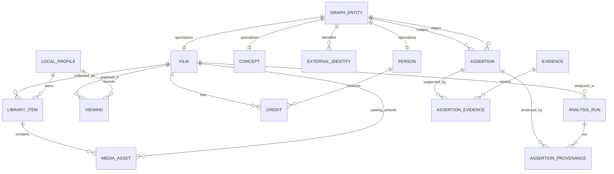

# Film / LibraryItem 领域模型 RFC

> 状态：Adopted；Canonical v1–v5、W3 v6–v7 与 W4 Persistence v8–v10 已实现
> 目标阶段：Gate A / W2 Schema Ready
> 基线：`origin/main` at `4426a6a`
> 范围：领域边界、逻辑 Schema、约束、兼容与迁移策略
> 非范围：本 RFC 不实现 SQLModel、数据库 migration、API 变更或数据回填

## 1. 背景与结论

当前 `Movie` 行同时代表电影作品、本地收藏条目、主视频文件、NFO、图片、
metadata 抓取状态和 AI 分析投影。`MovieUserState` 每部电影只有一行，无法保存重看；
`director`、`actors`、`genres`、`countries` 和 `analysis_data` 也缺少稳定实体身份。
当前事件系统是审计旁路与少量 `Movie` 同步投影的组合，并不是能完整重建所有领域数据的
事件源。

本 RFC 作出以下核心决定：

1. `Film` 代表与收藏和文件无关的规范电影作品；内部 ID 永不从 title、year、路径或
   provider ID 推导。
2. `LibraryItem` 代表一个收藏来源条目；同一 `Film` 可以有零到多个 `LibraryItem`。
3. `MediaAsset` 代表具体视频、NFO、图片或缓存资源；媒体缺失只改变资产/收藏状态，
   不删除 `Film`、`Viewing` 或用户审核数据。
4. 单用户阶段使用一个 `LocalProfile`；`Viewing` 一行代表一次观看，`favorite` 保存在
   电影级 `FilmProfileState` 中。
5. `Person`、`Credit` 和 `Concept` 保存规范实体与结构化关系；有争议或推断性的图关系
   使用 `Assertion`。
6. `Assertion.source_scope`（事实来源类别）与 `review_status`（审核决定）相互独立；
   `Evidence`（外部支持材料）与 `AssertionProvenance`（谁或哪次运行产生记录）相互独立。
7. `AnalysisRun` 用版本化输入计算幂等键；重试复用同一逻辑运行，不能复制 Assertion，
   也不能覆盖用户已经接受或拒绝的决定。
8. 旧 `Movie` ID 通过持久化 alias 解析。Beta 前保留 `/library`、
   `/library/{movie_id}`、user-state 与 watch-history 的路径和响应形状。
9. 新表上线采用 additive migration、升级前可验证备份、fixture 回归和分阶段切换。
   不能用旧事件回放替代旧 `Movie` 行的基线回填。

## 2. 设计原则

### 2.1 稳定 ID

- 新领域对象使用应用生成、带类型前缀的 UUIDv4 hex，例如 `film_<32hex>`、
  `lib_<32hex>`、`person_<32hex>`、`concept_<32hex>`、`view_<32hex>`。
- ID 是不透明标识，不编码 title、year、路径、语言、所有权或 provider。
- ID 创建后不可修改。实体合并保留旧 ID，并通过 `merged_into_id` 重定向；不批量改写
  外部引用。
- `Film`、`Person`、`Concept` 同时注册到内部 `GraphEntity` 表。`Assertion` 的 subject
  和 object 都外键引用该表，从而避免无数据库约束的多态字符串引用。
- 现有 `Movie.id` 不升级为新 `Film.id`。它进入 `LegacyMovieAlias`，继续作为兼容 API
  标识。

`GraphEntity` 和 `LegacyMovieAlias` 是实现完整性与兼容性所需的辅助表，不是新的产品概念：

| 表 | 关键字段与约束 |
| --- | --- |
| `GraphEntity` | `id` PK、`entity_type` (`film/person/concept`)、`lifecycle_status`、`merged_into_id`、时间戳；合并目标必须同类型 |
| `LegacyMovieAlias` | `legacy_movie_id` PK、`film_id`、`library_item_id`、`legacy_library_status`、时间戳；alias 永不复用到另一作品 |

### 2.2 身份与来源不是同一件事

- TMDB/IMDb ID 是可验证的外部身份，不是内部主键。
- 本地路径是 `LibraryItem`/`MediaAsset` 的 locator，不是 Film 身份。
- title + year 只用于候选匹配。没有外部身份时，迁移默认“一条旧 Movie 创建一个 Film”，
  不因重名自动合并。
- provenance 说明一条记录来自 NFO、TMDB、人工编辑还是某次 AnalysisRun；Evidence
  说明一项主张得到了什么外部材料支持。`AI inferred` 只能是 provenance，不能充当
  Evidence。

### 2.3 数据所有权与投影

用户输入、身份解析决定、审核决定和迁移 alias 是不可丢失的 durable data。列表聚合、
当前分析状态、兼容 `Movie`、Graph 邻接和缩略图属于可重建 projection。具体分类见第 7 节。

## 3. 关系概览



辅助关系 `FilmTitle`、`ConceptAlias`、`FilmCountry`、`FilmProfileState`、
`LibraryItemLocatorHistory` 和 `CreditProvenance` 已由相应 W3 additive Schema 实现；它们不改变
本 RFC 的聚合边界。W3 不增加临时 `FilmConcept` 表，Film 与 Concept 的正式关系仍由 W4
factual Assertion 表达。

## 4. 模型定义

以下是逻辑 Schema。具体 SQL 类型、constraint 名称和 migration DDL 由后续实现 RFC/diff
确定；时间统一存 UTC，应用层输出 ISO 8601。

### 4.1 Film

`Film` 是规范作品，不表达“用户拥有”或“文件存在”。

| 字段 | 含义 |
| --- | --- |
| `id` | PK，同时 FK → `GraphEntity.id` |
| `canonical_title` | 默认展示标题，不参与唯一性 |
| `original_title` | 原始片名，可空 |
| `release_date` / `release_year` | 日期可空；year 用于筛选和候选解析 |
| `runtime_minutes` | 作品目录时长；与媒体文件实际时长分离 |
| `overview` | 当前选定简介；完整来源值可保留在来源记录中 |
| `lifecycle_status` | `active/merged/tombstoned` |
| `merged_into_id` | 合并时指向保留的 Film |
| `created_at` / `updated_at` | 审计时间 |

约束与索引：

- PK `id`；`merged_into_id` FK → `Film.id`，`ON DELETE RESTRICT`。
- 索引 `(release_year, canonical_title)`、规范化 title 搜索索引和 `merged_into_id`。
- title + year **不唯一**。同名、同年不同作品必须可以共存。
- `FilmTitle(film_id, locale, title_type, title, normalized_title, origin_kind, origin_ref,
  observed_at, superseded_at)` 保存 `title_cn`、别名和本地化标题；索引
  `(normalized_title, locale)`。同一来源刷新只 supersede 自己的候选。
- `FilmCountry(film_id, iso_3166_1)` 保存唯一的大写 ISO 3166-1 alpha-2 关系，
  `FilmCountryProvenance` 保存多来源观察。无法规范化的旧名称先进入 review/raw source，不用
  本地化名称生成稳定 ID。

生命周期：扫描不能删除 Film。没有 LibraryItem 的 Film 是合法孤立/Unowned Film，仍可被
Viewing、Credit、Assertion 或 Graph 引用。硬删除仅允许显式维护操作，并要求不存在这些
durable 引用；常规操作使用 merge/tombstone。

### 4.2 ExternalIdentity（FilmIdentity）

使用通用 `ExternalIdentity` 表；`entity_type=film` 时即路线图中的 `FilmIdentity`。
provider namespace 必须包含资源类型，例如 `tmdb.movie`、`imdb.title`、`tmdb.person`，避免
TMDB 电影和人物数字 ID 冲突。

| 字段 | 含义 |
| --- | --- |
| `id` | PK |
| `entity_id` | FK → `GraphEntity.id` |
| `provider` | 受控 namespace |
| `external_id` | provider 规范化后的字符串 ID |
| `identity_status` | `active/deprecated/disputed` |
| `verified_at` | 最近验证时间，可空 |
| `provenance_kind` / `provenance_ref` | NFO、provider、人工或 migration 来源 |
| `created_at` / `updated_at` | 审计时间 |

约束与索引：

- `UNIQUE(provider, external_id)`，保证一个外部身份不能指向两个实体。
- 索引 `(entity_id, provider)` 和 `(provider, identity_status)`。
- 同一实体允许同 provider 的历史/重定向 ID；是否主身份由状态和来源策略决定。
- 外部 ID 冲突不得由 title/year 自动覆盖；迁移或扫描把冲突放入 identity review。
- 删除实体时 `RESTRICT`；身份废弃使用 `deprecated`，不复用历史映射。

### 4.3 LibraryItem

`LibraryItem` 是某个 LocalProfile 在某个来源中的收藏条目。它不是 Graph 节点。

| 字段 | 含义 |
| --- | --- |
| `id` | PK，稳定且与路径无关 |
| `profile_id` | FK → `LocalProfile.id` |
| `film_id` | FK → `Film.id` |
| `source_type` | `local_folder/local_nfo/jellyfin/...` |
| `source_instance_id` | 某媒体根或外部连接的稳定 ID |
| `source_item_key` | 来源当前 item key；本地来源通常为规范化相对路径 |
| `display_name` | 文件夹/来源显示名 |
| `availability_status` | `available/missing/ignored/retired` |
| `resolution_status` | `unresolved/matched/review_required/failed` |
| `added_at` / `last_seen_at` / `missing_since` / `retired_at` | 收藏生命周期 |
| `metadata_source` | 当前选定 metadata 来源摘要 |
| `metadata_updated_at` | 最近解析时间 |
| `scrape_status` / `scrape_error` / `scraped_at` / `match_confidence` | 兼容期操作状态 |
| `created_at` / `updated_at` | 审计时间 |

约束与索引：

- FK `film_id` 和 `profile_id` 均 `ON DELETE RESTRICT`。
- 活跃状态上对 `(source_instance_id, source_item_key)` 建 partial unique index；历史 locator
  写入 `LibraryItemLocatorHistory`，不能靠复用旧 alias 改变作品身份。
- 索引 `(profile_id, availability_status, added_at)`、`film_id`、`last_seen_at`、
  `(source_instance_id, resolution_status)`。
- 同一 Film 可有多个 LibraryItem，例如两个版本、两个媒体根或未来的外部只读来源。

Owned/Unowned 统一按查询推导：

- `Owned`：指定 profile 至少有一个 `available` 或 `missing` LibraryItem。
- `Unowned`：不存在上述 LibraryItem。Film 可以因 Graph、Viewing 或历史收藏而继续存在。
- `ignored`：保留 suppression 决定，但默认不计入 Owned、不出现在正常 Library。
- `retired`：来源条目已明确移除；保留历史与 alias，不计入 Owned。
- “可播放/媒体可用”是至少一个主视频 MediaAsset 为 `present`，不能与 Owned 等同。

### 4.4 MediaAsset

`MediaAsset` 保存具体资源及其观察状态。一个资产由 LibraryItem（本地视频/NFO/图片）或
Film（provider artwork reference）之一拥有，使用 XOR check constraint。

| 字段 | 含义 |
| --- | --- |
| `id` | PK |
| `library_item_id` / `film_id` | 两者恰有一个非空 |
| `asset_kind` | `video/nfo/poster/backdrop/thumbnail/other` |
| `locator_kind` | `local_path/provider_path/remote_uri/cache_path` |
| `locator` / `normalized_locator_hash` | 资源位置与用于去重的规范化 hash |
| `availability_status` | `present/missing/unknown/retired` |
| `file_size` / `file_mtime` / `content_fingerprint` | 文件观察值 |
| `width` / `height` / `codec` / `bitrate` / `duration_seconds` | 常用媒体属性 |
| `fps` / `dynamic_range` / `bit_depth` | 视频属性 |
| `stream_metadata` | 音轨等可重建技术详情；不是 Graph 数据 |
| `source` / `last_observed_at` / `missing_since` | 来源与生命周期 |
| `created_at` / `updated_at` | 审计时间 |

约束与索引：

- `CHECK ((library_item_id IS NULL) <> (film_id IS NULL))`。
- `UNIQUE(owner, asset_kind, normalized_locator_hash)`；索引
  `(library_item_id, asset_kind, availability_status)`、`film_id`、`content_fingerprint`。
- 本地绝对路径是敏感数据：允许数据库内部持久化，但不得进入 LLM 输入、匿名指标或未脱敏
  诊断包。
- 技术探测值、缩略图和远端 artwork cache 可以重建；用户选定 artwork 与 locator 关联决定
  需要保留 provenance。

### 4.5 LocalProfile 与 FilmProfileState

Beta 前不引入账号、认证、租户或权限语义。

`LocalProfile` 字段为 `id`、唯一 `profile_key='local'`、可选 `display_name` 和时间戳。
安装时幂等创建一行。未来多 profile migration 可以添加行，不改变 Viewing/收藏外键。

电影级用户状态使用辅助表：

```text
FilmProfileState(profile_id, film_id, favorite, created_at, updated_at)
UNIQUE(profile_id, film_id)
```

`favorite` 属于 Film，不属于某次 Viewing。`watched`、重看次数、最近观看时间和最近评分均
从 Viewing 投影，不在 FilmProfileState 重复保存。删除 LocalProfile 必须 `RESTRICT`，直到
用户通过明确的数据导出/删除流程处理其 LibraryItem、Viewing 和审核记录。

### 4.6 Viewing

一行 `Viewing` 代表一次可独立编辑和删除的观看记录。

| 字段 | 含义 |
| --- | --- |
| `id` | PK |
| `profile_id` | FK → `LocalProfile.id` |
| `film_id` | FK → `Film.id`，与 LibraryItem 无关 |
| `watched_at` | 可空；允许只知道看过但日期未知 |
| `watched_at_precision` | `timestamp/date/year/unknown` |
| `rating` | 可空，1–5，先保持旧 API 量表 |
| `review` | 原 `notes` 或 Diary review |
| `tags` / `mood` / `favorite_scene` | 可空的 Diary 数据 |
| `source` | `manual/legacy_movie_user_state/import/...` |
| `source_record_id` | 外部或兼容导入记录 ID，可空 |
| `review_status` | `confirmed/needs_review/rejected`；正常写入默认 confirmed |
| `created_at` / `updated_at` / `deleted_at` | 生命周期；删除先写 tombstone |

约束与索引：

- `CHECK rating BETWEEN 1 AND 5`；FK 均 `ON DELETE RESTRICT`。
- 索引 `(profile_id, watched_at DESC)`、`(profile_id, film_id, watched_at)`、`film_id`。
- 非空外部来源 ID 使用 `UNIQUE(profile_id, source, source_record_id)` 保证导入幂等。
- 同一 Film、同一日期允许多条记录，不能对 `(film_id, watched_at)` 建唯一约束。
- 只有 `review_status=confirmed` 且未删除的 Viewing 进入 watched、最近观看和观看次数投影；
  `needs_review/rejected` 记录仍是 durable data，但不能让系统推断用户看过该片。
- 删除 LibraryItem 不影响 Viewing。用户删除 Viewing 时保留 tombstone，导出默认排除已删除项，
  恢复/彻底清除必须是显式操作。

### 4.7 Person 与 Credit

`Person` 字段为 `id`（FK → GraphEntity）、`canonical_name`、`normalized_name`、可选
`sort_name`、`resolution_status`（`provisional/verified/review_required`）、
`lifecycle_status`、`merged_into_id` 和时间戳。姓名不唯一；规范化姓名只建非唯一搜索索引。
TMDB 等身份使用 ExternalIdentity；没有外部 ID 的旧演员/导演使用 provider
`legacy.local.person`，external ID 为 `SHA-256(source_instance_id + normalized_name)` 的不透明
值，只在同一 source instance 内复用，不能仅按同名跨来源合并。

`Credit` 字段：

| 字段 | 含义 |
| --- | --- |
| `id` | PK |
| `film_id` / `person_id` | 两端 FK，均 `RESTRICT` |
| `department` / `job` | 例如 `Directing/Director`、`Acting/Actor` |
| `character` | 演员角色，可为空字符串 |
| `billing_order` | 可空 |
| `semantic_key` | 规范化 `(film, person, department, job, character)` hash |
| `created_at` / `updated_at` | 审计时间 |

`UNIQUE(semantic_key)` 去重 canonical Credit。不同 NFO/TMDB/人工来源写入
`CreditProvenance(credit_id, origin_kind, origin_ref, observed_at, superseded_at)`，不通过复制
Credit 表达。metadata 刷新只能 supersede 对应来源，不能删除人工 curated Credit。

### 4.8 Concept

`Concept` 统一表达 `genre/theme/movement/visual_style/micro_genre` 等受控概念。

| 字段 | 含义 |
| --- | --- |
| `id` | PK，同时 FK → GraphEntity.id |
| `kind` | 受控枚举 |
| `canonical_key` | kind 内稳定、非本地化的 key |
| `canonical_name` / `description` | 默认展示与定义 |
| `lifecycle_status` / `merged_into_id` | 合并与停用 |
| `created_at` / `updated_at` | 审计时间 |

`UNIQUE(kind, canonical_key)`；索引 `(kind, canonical_name)`。别名和本地化值进入
`ConceptAlias(concept_id, locale, alias, normalized_alias, provenance_ref)` 在同一 Concept 内
去重，但允许两个 Concept 拥有相同别名，以便解析歧义进入 review。W3 只建立受控 Genre
字典与别名，不持久化 Film-to-Concept；Genre 等结构化赋值在 W4 落为
`source_scope=factual` 的 Assertion。Theme/Movement/Visual Style 通常来自 curated 或
inferred Assertion。概念名称本身不构成关系 Evidence。

### 4.8.1 Structured metadata review

`StructuredMetadataReview` 保存 Film、可选 LibraryItem、字段类型、原因码、字段级 raw value、
raw hash、来源、唯一 review key、状态和时间戳。raw value 上限为 4 KiB，不得包含绝对路径、
file URI、credential 字段、API key 或整个 NFO/TMDB 文档。review key 对 Film、字段、原因、
来源和 raw hash 的 canonical JSON 计算 SHA-256，保证回填和刷新幂等。

### 4.9 Assertion

`Assertion` 表达 Graph 中的语义主张，如 `HAS_GENRE`、`HAS_THEME`、`REMAKE_OF`、
`ADAPTED_FROM`、`INFLUENCED_BY`、`VISUALLY_SIMILAR_TO`。

Schema v8 的 `assertion-predicate.v1` 注册表固定九项：上述关系加 `HAS_MOVEMENT`、
`HAS_VISUAL_STYLE` 和 `HAS_MICRO_GENRE`。它记录 subject/object 类型、可空 Concept kind 与
Evidence policy。Analysis V2 模型仍只能输出原有八项；`HAS_GENRE` 只供结构化或 curated 来源。

| 字段 | 含义 |
| --- | --- |
| `id` | PK |
| `subject_entity_id` / `object_entity_id` | FK → `GraphEntity.id` |
| `predicate` | 版本化受控词表 |
| `qualifiers` / `qualifier_hash` | 方向、时间、角色等规范化限定信息 |
| `assertion_key` | subject + predicate + object + qualifier hash 的稳定 hash |
| `source_scope` | `factual/curated/inferred` |
| `review_status` | `proposed/accepted/rejected` |
| `review_method` / `review_policy_version` | `none/import_policy/user` 与可审计导入政策 |
| `confidence` | 可空的 0–1 评估值；必须有 `confidence_method` |
| `rationale` | 面向用户的简短解释，不保存 hidden chain-of-thought |
| `reviewed_by_profile_id` / `reviewed_at` | 用户审核信息 |
| `first_seen_at` / `last_seen_at` / `superseded_at` | 自动来源生命周期 |
| `created_at` / `updated_at` | 审计时间 |

语义和约束：

- `UNIQUE(assertion_key)`；索引 `(subject_entity_id, predicate, review_status)`、
  `(object_entity_id, predicate, review_status)`、`(source_scope, review_status)`。
- `factual` 表示来自结构化、可核对的事实来源；`curated` 表示编辑/专家来源；`inferred`
  表示模型或规则推断。它们不代表审核结论。
- `proposed/accepted/rejected` 是审核状态。结构化 provider 事实可按导入政策直接 accepted，
  但必须记录 `review_method=import_policy`、政策版本、factual scope 和 provenance；用户决定
  使用 `review_method=user`、LocalProfile reviewer 和审核时间。
- LLM 自报的“high confidence”不能转换为 factual，也不能直接作为 confidence；
  `confidence_method` 必须说明是规则分数、来源等级、评测校准或人工值。
- 自动模型流程只可创建 proposed Assertion，并更新 `last_seen_at`、provenance 和 Evidence。
  accepted/rejected 不能被自动刷新重置；唯一自动 accepted 入口是版本化 trusted import policy，
  当前仅为 NFO/TMDB/Legacy 唯一解析 Genre 的 `structured-genre-import.v1`。
- `assertion_key` 不包含 source_scope 或 AnalysisRun。相同语义边被更强来源再次观察时，
  Assertion 可按 `inferred → curated → factual` 单向提升汇总 scope，但每个来源的原始 scope
  仍保存在 provenance，且 review_status 不变。
- 旧运行不再产生某条边时，设置 `superseded_at`，不物理删除。accepted/rejected 默认仍显示
  审核历史；产品查询可以区分“当前来源仍支持”与“历史审核决定”。

### 4.10 Evidence 与 AssertionProvenance

Evidence 是外部支持材料，不是生成记录。v1 只保存已经通过安全检索与内容政策的 HTTP(S)
`catalog/web/dataset` 来源；NFO 是 provenance，用户说明是 curated rationale：

| 字段 | 含义 |
| --- | --- |
| `Evidence.id` | PK |
| `evidence_type` | `catalog/web/dataset` |
| `source_title` / `source_uri` / `publisher` | 来源描述；URI 视为不可信输入 |
| `claim` | 与 Assertion 相关的短摘要或可核查 claim |
| `published_at` / `retrieved_at` | 来源时间 |
| `content_hash` | 去重与变更检测 |
| `verification_policy_version` | 完成安全检索和内容校验的政策版本 |
| `created_at` / `updated_at` | 审计时间 |

`AssertionEvidence(assertion_id, evidence_id, stance, link_status, created_at, revoked_at)` 支持一个 Evidence 关联多个
Assertion，`stance` 为 `supports/contradicts/context`。唯一约束 `(assertion_id, evidence_id,
stance)`；删除两端均 `RESTRICT`，显式撤销使用关联状态而不是级联清除。

Provenance 单独保存：

```text
AssertionProvenance(
  id, assertion_id, origin_kind, origin_scope, origin_ref,
  analysis_run_id NULL, source_field NULL, source_payload_hash NULL,
  first_observed_at, last_observed_at, superseded_at
)
```

- `origin_kind` 可为 `nfo/tmdb/migration/user/analysis_run/rule`。
- `analysis_run_id` 只说明哪次运行产生了提议；它不证明提议正确。
- `UNIQUE(assertion_id, origin_kind, origin_ref)`；索引 `analysis_run_id` 和 `origin_ref`。
- 重分析命中同一 `assertion_key` 时追加/刷新 provenance 和 Evidence，绝不重置
  `review_status`。因此 rejected Assertion 在重分析后仍为 rejected。

### 4.11 AnalysisRun

`AnalysisRun` 是一次版本化、可诊断的逻辑分析，不是 Movie 上的状态字符串。

| 字段 | 含义 |
| --- | --- |
| `id` | PK |
| `film_id` | FK → Film，`RESTRICT` |
| `analysis_kind` | 如 `genealogy_v2` |
| `provider` / `model` | 实际 provider 与 model 标识 |
| `prompt_version` / `schema_version` | prompt 和结构化输出版本 |
| `resolver_version` / `policy_version` | 实体解析与 Assertion 接纳策略版本 |
| `app_version` | 运行代码版本 |
| `input_hash` / `output_hash` | 规范化输入/输出 hash |
| `idempotency_key` | 见下方公式 |
| `status` | `queued/running/succeeded/failed/cancelled` |
| `attempt_count` | 同一逻辑运行的尝试次数 |
| `input_tokens` / `output_tokens` / `estimated_cost` / `currency` | 成本信息 |
| `correlation_id` / `job_id` | Job/Event 追踪 |
| `started_at` / `finished_at` | 运行时间 |
| `error_category` / `error_code` / `error_message` | 脱敏错误 |
| `result_summary` | 通过 Analysis V2 验证的用户可见短摘要，最多 1200 字符 |
| `created_at` / `updated_at` | 审计时间 |

幂等键定义：

```text
sha256(
  film_id + analysis_kind + provider + model +
  prompt_version + schema_version + resolver_version + policy_version +
  app_version + input_hash
)
```

- `UNIQUE(idempotency_key)`；索引 `(film_id, analysis_kind, status, created_at DESC)`、
  `correlation_id`、`job_id`。
- `input_hash` 对去除路径、密钥、无关本地信息后的 canonical JSON 计算。
- 同键成功运行直接复用；失败/取消的重试复用同一 AnalysisRun，增加 `attempt_count`。
  每次尝试的细节继续由 Job/Event 审计；若未来需要不可变尝试历史，再加 `AnalysisAttempt`。
- version 任一变化都会产生新键和新逻辑运行。写入 Assertion 时仍按 `assertion_key` 去重。
- Schema v8 不建立 AnalysisArtifact，也不保存 raw input/output。结构化 Assertion/Evidence、
  版本、hash、成本、脱敏错误、审核状态和验证后的用户可见摘要持久化；raw prompt/response、
  hidden reasoning、网页正文、绝对路径和密钥不落库。

### 4.12 AnalysisResolutionReview

无解析结果、身份歧义、谓词类型不匹配或未通过 Evidence 安全/内容政策的候选进入独立
`AnalysisResolutionReview`。记录只包含 AnalysisRun、Film、可空 predicate、候选类型、原因码、
不超过 4 KiB 的 allowlist candidate summary、candidate/review hash、状态和可空 resolved entity。
同一运行和候选重放必须命中唯一 review key；review 不保存整个模型输出、网页正文、路径或凭据，
也不能直接创建 GraphEntity。

### 4.13 Analysis evaluation and Gate B

Gate B 不是领域表或 migration。它在忽略目录中的全新 schema-v10 SQLite 数据库运行相同的
Library Analysis V2 service，并以版本化契约验证生成、解析、持久化、恢复、成本和人工质量：

- `analysis-eval.v1`：36 个公共 Film case，稳定合成 Film ID，Film 目标使用 provider-qualified
  identity，Concept 目标使用 kind、规范化名称和经人工裁定的有限 alias。36 个 case 已在查看
  live 输出前冻结为 `adjudicated/annotator_count=1`；alias 只属于评测契约，不进入模型输出。
- `gate-b-policy.v2`：在 v1 的完成率、边可接受率、实体解析、required recall、Evidence、幂等、
  rejected/revoked 保护、helpfulness、成本、恢复和隐私阈值上，增加外部 ID 与标题/年份矛盾、
  qualifier policy 和每案 Assertion 数量的严格检查。
- `analysis-eval-human-review.v1`：以 run、dataset 和 prediction hash 关联 1–5 helpfulness 及
  novel prediction 的 `acceptable/incorrect/harmful` 裁定，不保存 reviewer 姓名。

Gate B 报告只保留通过 Analysis V2 契约的有界 summary、rationale、规范关系、Evidence 元数据、
哈希和聚合指标；不保存 raw prompt/response、provider exception、网页正文、hidden reasoning、
路径或密钥。缺精确模型/定价、live 结果或输出后人工评分时必须 `blocked`；证据齐全但
低于质量或安全阈值时为 `failed`。Gate B 与 Gate A 独立，二者都通过前不授权 Graph UI。

## 5. 现有字段迁移映射

### 5.1 Movie

| 当前字段 | 目标模型/字段 | 迁移与兼容说明 |
| --- | --- | --- |
| `id` | `LegacyMovieAlias.legacy_movie_id`；新建 Film/LibraryItem ID | 绝不把路径/外部 ID 形式继续当内部 Film PK |
| `title` | `Film.original_title` 或 canonical；`FilmTitle` | 保留原值与来源 |
| `title_cn` | `FilmTitle(locale='zh', title_type='localized')` | 不覆盖 original title |
| `year` | `Film.release_year` | 0 转为未知/null；不参与唯一约束 |
| `tmdb_id` | `ExternalIdentity(provider='tmdb.movie')` | 精确相同 ID 可合并到同 Film |
| `imdb_id` | `ExternalIdentity(provider='imdb.title')` | 与 TMDB 冲突时进入 review，不自动覆盖 |
| `overview` | `Film.overview` + provenance | 当前选定简介 |
| `plot` | `Film.overview` 候选/来源文本 | 与 overview 不同则保留来源值，不静默丢弃 |
| `director` | provisional `Person` + `Credit(job='Director')` | 多人/分隔符不确定时进入 review |
| `actors` | `Person` + `Credit(job='Actor', character, billing_order)` | 现有姓名无外部 ID，不全库按同名强合并 |
| `genres` | `Concept(kind='genre')` + factual `HAS_GENRE` Assertion | provenance 指向 NFO/TMDB/migration |
| `countries` | `FilmCountry.iso_3166_1` | 无法映射的名称保留 raw/review |
| `runtime` | `Film.runtime_minutes` | 与实际 `MediaAsset.duration_seconds` 分离 |
| `imdb_rating` | 辅助 `ExternalScore`/来源信号 | 不是用户 Viewing rating |
| `external_scores` | `ExternalScore` 规范记录 | 保留 source/kind/edition/fetched_at 等来源字段 |
| `external_scores_updated_at/error` | ExternalScore refresh projection | error 脱敏，非 Film 核心字段 |
| `poster_local` / `backdrop_local` | LibraryItem-owned `MediaAsset` | `asset_kind=poster/backdrop`, local_path |
| `poster_thumb_local` / `backdrop_thumb_local` | cache `MediaAsset`/可重建 projection | 不作为备份完整性的核心计数 |
| `poster_path` / `backdrop_path` | Film-owned provider `MediaAsset` | provider_path/remote reference，可重建 cache |
| `folder_name` | `LibraryItem.display_name` | 仅展示/来源容器 |
| `folder_path` | `LibraryItem.source_item_key`/locator history | 规范化相对路径优先；绝对路径不作 Film 身份 |
| `video_file` / `media_path` | video `MediaAsset.locator` | 主视频角色由 asset_kind/selection 表达 |
| `file_size` / `file_mtime` | video `MediaAsset` | 观察值，不作单独身份依据 |
| `video_width/height/codec/bitrate/duration/fps/dynamic_range/bit_depth` | video `MediaAsset` 技术字段 | 可由 ffprobe 重建 |
| `audio_tracks` | `MediaAsset.stream_metadata` | 可重建的技术 JSON；后续需要查询再规范化 MediaStream |
| `nfo_file/path/size/mtime/fingerprint` | NFO `MediaAsset` | fingerprint 用于变化检测，不是 Film ID |
| `nfo_source` | NFO Asset/metadata provenance | `filename/tmm/tmdb` 映射为受控 origin_kind |
| `added_at/last_seen_at/missing_since` | `LibraryItem` 生命周期 | 尽量原值保留，无法解析时记录 migration warning |
| `library_status` | `LibraryItem.availability_status` | available/missing/ignored 直映；reverted → retired，并由兼容层回显旧值 |
| `metadata_updated_at/source` | `LibraryItem` metadata 状态/provenance | 不是 Film 身份 |
| `scrape_status/error/scraped_at/tmdb_confidence` | `LibraryItem` resolution/scrape 兼容状态 | 未来可由 MetadataRun 投影，但 W3 先保形状 |
| `analysis_status` | 最新 `AnalysisRun` projection | 不作为新系统事实源 |
| `micro_genre` / `micro_genre_definition` | Concept + inferred `HAS_MICRO_GENRE` Assertion | 定义进入 Concept.description，保留 legacy provenance |
| `analysis_data` | Legacy compatibility projection + normalized Assertions/Evidence | v10 只迁移有界摘要与可解析关系，不建立 raw artifact；原 Movie JSON 暂留作回退投影 |

旧 `analysis_data` 的细分映射：

- `tmdb_metadata` → Film/ExternalIdentity/Genre provenance；
- `micro_genre` → Concept + inferred Assertion；
- `ancestors` → 解析引用 Film 后写入当前 Film `INFLUENCED_BY` 方向的 proposed Assertion；
- `descendants` → 解析引用 Film 后写入目标 Film `INFLUENCED_BY` 当前 Film 的 proposed Assertion；
- `type` 进入 predicate/qualifier，`reason` 进入 rationale；两者都不是 Evidence；
- `influence_impact` 只作为 AnalysisRun 的有界用户可见摘要，不能伪装成结构化边；
- 未解析 title/year 进入 bounded review，不创建无稳定 ID 的正式 Graph 节点。

### 5.2 MovieUserState

| 当前字段 | 目标 | 规则 |
| --- | --- | --- |
| `movie_id` | alias → `film_id` | 一部 Film 的多个 LibraryItem 共用个人状态 |
| `favorite` | `FilmProfileState.favorite` | 即使没有 Viewing 也保留 |
| `watched` | Viewing 存在性/兼容导入标记 | true 创建 legacy Viewing；false 本身不创建观看事件 |
| `watched_at` | `Viewing.watched_at` | 解析失败保留 raw migration 记录，precision=unknown |
| `rating` | `Viewing.rating` | 保持 1–5 |
| `notes` | `Viewing.review` | 不写 Film 公共 metadata |
| `updated_at` | Viewing/FilmProfileState migration 时间来源 | 同时保留原值供核对 |

若 `watched=true`，或 `watched_at` 非空，创建一个 `review_status=confirmed`、
`source=legacy_movie_user_state` 的兼容 Viewing。对于 `watched=false` 且没有 `watched_at`、
但存在 rating/notes 的不一致旧行，仍创建 Viewing 以保留原字段，但标记
`review_status=needs_review`、`watched_at_precision=unknown`；该行不进入 watched、最近观看和
观看次数投影。兼容 GET 在没有 confirmed Viewing 时继续返回 `watched=false`，同时可从这条
待审核记录回显原 rating/notes，直到用户确认或拒绝。完全空且 favorite=false 的默认行无需
制造 durable Viewing。

若多个旧 Movie 合并为同一 Film，每条非空 MovieUserState 仍以原 `movie_id` 作为
`source_record_id` 独立迁移，避免猜测两次观看是否重复；favorite 采用 OR 语义。冲突记录进入
review 报告，兼容读取对这些 alias 返回同一个 Film 级聚合状态。

## 6. 扫描、缺失与删除语义

### 6.1 重复扫描和重新关联

1. 先按 source instance + 当前/历史 source key 查找 LibraryItem。
2. 再按已知 MediaAsset fingerprint/平台文件标识匹配移动或改名。
3. 再用明确 ExternalIdentity 解析 Film；相同 TMDB/IMDb 可让多个 LibraryItem 指向同一 Film。
4. 只有 title/year 候选时不自动跨条目合并；创建/保留独立 Film 并进入 review。
5. 匹配成功更新现有 LibraryItem/MediaAsset 的观察值和 `last_seen_at`，不创建新 ID。
6. 同一次 reconcile 未看到的条目先标记 missing；不立即 retired 或删除。

### 6.2 多 LibraryItem

- Film ownership、可用性与画质从全部 LibraryItem/MediaAsset 聚合。
- 删除或缺失其中一个 item 不影响其他 item。
- metadata 默认写入 Film；路径、NFO 和本地 artwork 写入目标 LibraryItem/MediaAsset。
- 来源冲突保留 provenance；不能用最后一次扫描无条件覆盖用户选定 canonical 值。

### 6.3 媒体缺失与恢复

- 文件暂时不存在：MediaAsset → missing；若该 item 没有可用主视频，LibraryItem → missing。
- Film、ExternalIdentity、Viewing、Credit、Concept、Assertion、Evidence、AnalysisRun 不变。
- 相同 item 恢复：恢复原 LibraryItem/MediaAsset ID，清除 `missing_since`。
- 路径改变但可确定为同一资产：更新 locator，并写 LocatorHistory；外部兼容 alias 不变。
- 无法确定是否同一资产：创建/保留候选并要求 review，不进行破坏性合并。

### 6.4 删除矩阵

| 操作 | 行为 |
| --- | --- |
| 清理 missing | LibraryItem/MediaAsset soft-retire；Film 与个人/Graph 数据保留 |
| 删除一个 LibraryItem | soft-retire item；不级联 Film 或 Viewing |
| 删除 Viewing | 用户显式 soft-delete/tombstone；不影响 Film/LibraryItem |
| 删除/合并 Film | 默认禁止硬删；merge 保留 redirect；有 durable 引用时 `RESTRICT` |
| 删除 Person/Concept | 有 Credit/Assertion 时 `RESTRICT`；使用 merge/tombstone |
| 删除 Assertion | 自动 proposed 可 supersede；accepted/rejected 不由自动流程删除 |
| 删除 Evidence/AnalysisRun | 有关联时 `RESTRICT`；按经批准的 retention/脱敏流程归档 |
| `DELETE /library` 兼容入口 | 未来实现改为 retire 收藏条目，保留 Film/Viewing/审核数据 |
| `DELETE /library/data` | 真正全量重置；实现前必须增加确认、已验证备份与恢复说明 |

## 7. Durable data 与可重建 projection

### 7.1 Durable data

- Film/Person/Concept 的稳定 ID、merge redirect、ExternalIdentity 和 alias；
- LibraryItem 稳定关联、ignored/retired 等用户或恢复决定、locator history；
- LocalProfile、FilmProfileState、Viewing（包括 tombstone）；
- 人工或来源解析后的 Credit/Concept 关系及 provenance；
- Assertion 的 accepted/rejected 状态、reviewer/time、Evidence 和 provenance；
- AnalysisRun 的版本、hash、成本、状态与脱敏错误；
- LegacyMovieAlias、migration journal、备份元数据和 settings；
- 现有 EventRecord 审计历史。旧事件必须原样保留，但不作为新表唯一事实源。

### 7.2 可重建 projection/cache

- `/library` 兼容 `Movie` 行/视图与 `MovieUserState`；
- Owned/Unowned、可播放状态、watch history、latest rating、rewatch count；
- Graph adjacency、Explore 聚合、Cinema DNA、搜索索引和当前分析状态；
- ffprobe 技术详情、缩略图、远端 artwork cache 和外部分数 freshness；
- 从规范 Assertion 生成的 legacy `analysis_data` 兼容 payload；
- SSE 通知和 Job 进度展示。

现有 `EventRecord` 包含审计、side effect、补偿和部分可投影事件；旧版本事件 payload 并不完整，
某些 `MovieStateBackfilled` 也只是 migration snapshot。因此 W3 初次回填以旧 Movie/
MovieUserState 当前行 + verified backup 为基线，事件只用于审计核对，不能从 empty replay 生成
新领域真相。新领域事件使用 `aggregate_type=film/library_item/viewing/assertion` 和稳定 ID，
同时保留 `schema_version`、command/correlation/causation 字段。

## 8. Beta 前兼容层

### 8.1 兼容读取

- `GET /library`：继续返回 `Movie[]` 形状。每个非 retired LibraryItem 生成一条兼容 Movie；
  字段由 Film + 该 LibraryItem + 选定 MediaAsset + projection 组成。多个 item 指向同一 Film 时
  默认返回多条，分别保留 item 的兼容 `id` 和路径字段。
- `GET /library/{movie_id}`：先查 LegacyMovieAlias，再组合同样的 Movie payload。alias 不因
  Film merge 或文件改名失效。
- 新创建的 LibraryItem 没有旧 ID 时，使用其 `lib_<uuid>` 作为兼容 movie_id；仍不暴露内部
  Film ID 代替旧字段。
- 新 Graph/Film API 使用 Film ID；兼容 API 不以 title 或路径解析 Film。
- 兼容层初期维持当前列表状态包含规则和响应字段；Owned 筛选只在新 API 中采用第 4.3 节
  定义，避免暗中改变旧客户端行为。

### 8.2 user-state 与 Watch History

- `GET /library/{movie_id}/user-state` 和 `/library/user-states` 返回原字段：
  `movie_id` 为请求/主兼容 alias，`watched` 只由 confirmed active Viewing 是否存在推导，
  `watched_at`、`rating`、`notes` 通常取最近 confirmed Viewing，`favorite` 来自
  FilmProfileState。若没有 confirmed Viewing 但有 `needs_review` 的 legacy 记录，则保持
  `watched=false`、`watched_at=null`，并回显待审核记录的 rating/notes，避免静默丢失。
- `GET /watch-history` 仍每 Film 一项，只使用最近 confirmed Viewing 排序；新 Diary API 才
  返回每次观看，待审核迁移记录通过独立 review 状态展示。
- `PUT .../user-state` 更新 `favorite`，并只 upsert 一条唯一的 compatibility Viewing
  (`source=legacy_user_state_api`)；不能覆盖 Diary 创建的其他 Viewing。
- 设置 `watched=false` 只 soft-delete compatibility Viewing。若仍存在其他 Diary Viewing，
  返回的 derived `watched` 仍为 true，避免兼容接口意外删除真实日记。
- 多个 LibraryItem 指向同一 Film 时，各 alias 读取相同 Film 级个人状态。

### 8.3 兼容写入与事件

- 新 Schema 成为 source of truth 前保持旧表写入；切换后，服务层在同一事务写新领域表并
  刷新兼容 projection。不能靠异步 SSE 保证一致性。
- 现有 `/library/analyze/{movie_id}` 先解析 alias → Film，再创建/复用 AnalysisRun；accepted/
  rejected Assertion 不受影响。
- `/library/{movie_id}/audit-events` Beta 前继续返回 legacy movie aggregate 历史；新 API 可按
  Film/LibraryItem 稳定 ID 查询新事件。迁移不改写旧 event ID 或 payload。
- Beta 前不删除旧路径。弃用必须先有版本化新 API、前端切换、兼容 contract tests 和至少一个
  发布周期告警。

## 9. 迁移顺序

本节是执行方案，不包含本任务中的实现。

1. **建立 migration runner**：记录 schema version、checksum、started/finished/status；停止依赖
   `create_all + ALTER ADD COLUMN` 作为长期方案。
2. **升级前检查与备份**：暂停写入/Job/watcher，执行 WAL checkpoint 或 SQLite online backup，
   校验 `PRAGMA integrity_check`、可打开性、文件大小和 backup hash。
3. **Gate A Additive Schema**：只新增 GraphEntity、Film、ExternalIdentity、LibraryItem、
   MediaAsset、LocalProfile、Viewing、FilmProfileState、alias/review/migration 表；旧表不改名、
   不删除。Person/Credit/Concept 已由 W3 v6–v7 实现；Assertion/Evidence/AnalysisRun 的
   additive Schema 已由 W4 v8 实现，但它们的 runtime 和质量仍属于 Gate B，不扩大 Gate A。
4. **创建单例 profile**：幂等创建 `profile_key=local`。
5. **回填 Film 身份**：按 TMDB 精确 ID、IMDb 精确 ID 顺序复用 Film；两者冲突时停止自动合并并
   记录 review。无外部身份时每旧 Movie 单独创建 Film。
6. **回填收藏与资产**：每旧 Movie 创建 LibraryItem、LegacyMovieAlias、视频/NFO/artwork
   MediaAsset；保留 status 和时间。
7. **W3 结构化 metadata（已完成）**：Schema v6 建立 title/country、Person/Credit、Genre
   Concept 与 review/provenance 基础；data migration v7 完成确定性 Legacy 回填，NFO/TMDB
   runtime observation 在同一事务同步 Canonical 与兼容投影。W4 v9 已消费这些 observation
   建立 factual `HAS_GENRE`，但 W3 本身仍不作为 Gate A 通过条件。
8. **回填个人数据**：先 FilmProfileState，再按第 5.2 节创建 legacy Viewing；对每个旧状态记录
   输出迁移结果。
9. **W4 分析持久化**：Schema v8 已建立谓词注册表、Assertion、Evidence、AnalysisRun、
   provenance/link 和 analysis review；v9 同步 factual Genre Assertion；v10 已为兼容 Legacy
   analysis 建立版本化 AnalysisRun，并由 runtime 在同一事务写入 proposed Assertion、验证后的
   Evidence、review 和 Movie 兼容投影。Legacy reason 只作 rationale，不生成 Evidence。
10. **一致性检查**：核对旧 Movie → alias/item 一一覆盖、身份冲突、UserState 字段、状态分布、
    引用完整性和可重跑结果；migration 重跑不得增加记录。
11. **双读/影子校验**：旧 API 仍读旧表，同时生成新兼容 payload 做 diff；路径字段允许规范化
    差异，其余差异必须解释。
12. **切换 source of truth**：通过 fixture、备份恢复和兼容测试后，服务写新表并同步兼容
    projection；保留旧表与 alias 至少到 Beta 结束。
13. **后续清理**：只有另一个明确 RFC/发布计划才可停止 dual write 或删除旧表。

## 10. 备份、回滚与失败处理

- 原数据库和 `D:\Projects\5X49\docs\product-roadmap.md` 等本地源文件都不能被 migration
  当作输出目标。本 RFC 只涉及应用 SQLite 数据库。
- 在 WAL 模式下不能运行中简单复制单个 `.db` 文件。使用 SQLite backup API，或完全停止
  写入并 checkpoint 后复制完整数据库状态。
- 备份命名至少包含 app version、schema version、UTC 时间和 hash；默认保留到用户完成一次
  升级后恢复演练。
- 每次 migration 写 journal。可重跑步骤使用 source row ID + migration version 的唯一键。
- additive/backfill 阶段失败时，旧表保持可读；修复后可重跑。任何 destructive cutover 的
  rollback 以恢复已验证备份为准，不承诺危险的自动 down migration。
- 切换新表写入后，旧版本应用可能看不到新 Viewing/审核结果。允许应用回滚前必须先证明
  dual write 完整，或提供向旧 schema 的导出；否则回滚应用与恢复数据库必须成对执行。
- Gate A 恢复演练必须比较 Film、LibraryItem、Viewing 和 alias，并抽查内容/hash，而不只验证
  进程能启动。accepted/rejected Assertion 的恢复与状态保护由 W4/Gate B 验收。
- 备份失败、完整性检查失败、磁盘空间不足、身份冲突超过阈值或 fixture 回归失败时，migration
  必须 fail closed，不切换 source of truth。

## 11. 旧数据库 fixture 场景

至少维护以下可版本化、无真实用户数据的 SQLite fixture：

1. 空数据库和全新 `create_all` 数据库；
2. 只含早期 Movie 列、需要当前手写 ADD COLUMN 的最旧受支持数据库；
3. 当前完整 Movie + MovieUserState + Job + EventRecord 数据库；
4. 同 TMDB 或 IMDb、不同路径的两条 Movie → 一个 Film、两个 LibraryItem；
5. TMDB 与 IMDb 分别指向不同既有 Film 的冲突记录 → review/fail closed；
6. 无外部 ID、同 title/year 的两条本地记录 → 不自动合并；
7. available、missing、ignored、reverted 以及路径改名/媒体恢复；
8. 视频缺失但 NFO/artwork 仍在、一个 item 多视频、同 Film 多画质版本；
9. 非 ASCII/中英文标题、超长路径、大小写差异和规范化路径碰撞；
10. UserState：watched true 有/无日期、favorite-only、rating/notes、全部默认值、无法解析日期、
    watched=false 但含 rating/notes；
11. analysis pending/processing/completed/failed、合法 JSON、部分字段、畸形/未知版本、同一边重复；
12. 旧 EventRecord 无初始化事件、含 backfill snapshot、重复审计和不同 schema_version；
13. external_scores、远端 artwork、缺失 thumbnail 和 ffprobe 技术字段；
14. migration 在每个主要阶段中断后重跑；
15. 升级 → 写入新 Viewing/审核状态 → 备份 → 恢复 → 数量和内容一致。

Gate A fixture 断言至少覆盖：record count、唯一约束、FK、alias 可解析、幂等重跑、状态映射、
兼容 JSON contract，以及数据库恢复后的 hash/抽查。rejected Assertion 重分析保护进入
W4/Gate B fixture。

## 12. Gate A 验收检查表

RFC/决策：

- [x] Film 与 LibraryItem/MediaAsset 边界明确。
- [x] Viewing 为多记录模型，favorite 与兼容状态有归属。
- [x] Assertion、Evidence、provenance、AnalysisRun 边界和重分析规则明确。
- [x] 稳定 ID、外部身份、唯一约束、索引、关系和删除语义明确。
- [x] 旧字段映射、Owned/Unowned、多 item、孤立 Film、missing/restore 行为明确。
- [x] 兼容层、迁移顺序、备份/回滚和 fixture 范围明确。
- [x] 第 13 节的 Gate A blocking 决策已由维护者于 2026-08-21 确认。

实现 Gate（本 RFC 不声称已经通过）：

- [x] 版本化 migration runner、v1–v6 additive schema、v7/v9/v10 确定性 data migration 与 W4
  additive Schema v8 已实现并 review；v6–v10 不扩大 Gate A 的验收边界。
- [x] 九套旧库 fixture 与 fresh `create_all` 向前迁移和重复执行通过。
- [x] 隔离 fixture 的迁移前备份、失败恢复和离线恢复/重迁移测试通过。
- [ ] 真实资料库副本的 Film/LibraryItem/Viewing/alias 数量与字段一致性报告通过。
- [x] ExternalIdentity 冲突、错误合并拒绝和 review 关联测试通过。
- [x] 生成 fixture 的重复扫描、路径改名、媒体缺失/恢复和多 LibraryItem 测试通过。
- [x] `/library`、详情、user-state、watch-history 兼容 contract tests 通过。
- [x] 旧 Movie/Library EventRecord 逐字节语义保留；稳定 LibraryItem 事件和公开 Job 结果通过
  canary 扫描。
- [ ] 真实资料库的迁移/诊断/日志隐私 canary 检查通过。
- [ ] Docker 首装、旧库升级、三读源回退、恢复和中英文浏览器 smoke 通过。
- [ ] Gate A 审核结论记录为通过后，才开始 Graph UI。

当前结论（2026-08-24）：**Blocked**。人工刮削并添加个人状态的策展式验收库已通过全部本地
Gate 阶段，但它仍是生成媒体，不替代自然积累的真实资料库副本；Docker CLI 也尚不可用。
严格 Gate 不允许用开发库副本、策展 fixture 或静态脚本检查替代上述两类证据。

## 13. 决策记录与后续开放项

以下三个 Gate A blocking 项已由维护者于 2026-08-21 确认，W3 Schema 和回填必须以此为准：

1. **多 LibraryItem 的旧 `/library` 表示（已确认）**：每个非 retired LibraryItem 生成一条
   兼容 Movie 行。多个 item 指向同一 Film 时返回多条，Film metadata 可以相同，但每行保留
   自己的兼容 ID、路径、媒体状态和资产字段；不使用 primary item 隐藏其他版本。旧 item
   保留 LegacyMovieAlias，新 item 使用 `lib_<uuid>` 兼容 ID。
2. **本地改名/移动的稳定匹配算法（已确认）**：只在同一 profile 和 source instance 内按
   以下顺序重新关联 LibraryItem：
   1. 当前或历史 `source_item_key` 精确命中；
   2. 同一文件系统卷内的平台稳定文件 ID 精确命中；
   3. `file_size + SHA-256(first/middle/last 4 MiB)` 快速 fingerprint 唯一命中，小于采样窗口
      的文件直接计算完整内容 hash；单个候选前台读取预算最多 12 MiB；
   4. 快速 fingerprint 冲突时，仅由单并发后台任务计算完整 content hash，不能阻塞正常扫描。

   自动重新关联必须只有一个候选，且不能与已知 ExternalIdentity 冲突。零个候选、多个候选、
   完整 hash 仍重复或身份冲突时均保持独立并进入 review；title/year、规范化文件名和目录名只
   用于候选排序和人工说明，绝不单独触发自动合并。
3. **不一致 legacy UserState（已确认）**：`watched=false` 且无 `watched_at`、但有 rating/notes
   时创建 `review_status=needs_review` 的 legacy Viewing 保存原字段。它不进入 watched、最近
   观看或观看次数投影；兼容 GET 返回 `watched=false`、`watched_at=null`，但在没有 confirmed
   Viewing 时回显原 rating/notes。用户确认后改为 confirmed；拒绝后保留 rejected 审计记录。

以下项目不是 W3 Schema 的 Gate A blocker，仍按对应阶段单独决策：

4. **兼容 PUT `watched=false`**：本 RFC 默认只删除 compatibility Viewing，不删除 Diary
   Viewing；需要在 API 文档实施阶段明确告知旧客户端。
5. **Analysis raw input/output（已确认）**：Schema v8 不保存 raw input/output 或网页正文，也不
   建立 AnalysisArtifact。只保存 canonical hash、版本、成本、脱敏错误、结构化结果和验证后的
   用户可见摘要；密钥、绝对路径和 hidden reasoning 不保存。
6. **Concept 受控词表治理**：Schema 与 W3/W4 持久化边界已确认；Genre canonical key、初始
   别名集和来源优先级必须在 Structured Metadata Slice 2 开始前形成版本化字典。micro-genre、
   theme 和 movement 的治理仍留给 Analysis/Graph RFC。
7. **Evidence 抓取边界（v1 已确认）**：只保存已通过公共 HTTP(S) 网络和内容政策验证的
   catalog/web/dataset 元数据与不超过 400 字符的 claim，不保存正文。URI 禁止 userinfo、敏感
   query、非公共 literal IP、file scheme；运行时还必须对 DNS 结果和每次 redirect 重新校验。
   失效链接的刷新频率和重试调度留给 W4 runtime Slice。
8. **Film merge/unmerge 操作面**：本 RFC 定义 redirect 与 RESTRICT，但批量合并、撤销和冲突
   UI 属于后续 entity-resolution 设计。
9. **ExternalScore、Studio、Collection 的完整规范表**：本 RFC 只定义当前字段去向，不把它们
   纳入 Gate A 核心模型；应在 Explore 需要前单独确认。

## 14. 文档同步边界

本文件是 Schema RFC，未改变 endpoint、响应、数据库或运行行为，因此本任务不修改
`docs/api.md`、`skills/5x49-backend/SKILL.md`、README、Compose 或路线图。后续实现一旦改变
endpoint/response，必须同步 API 文档和外部 Skill；一旦实现 migration/恢复，必须新增升级与
恢复说明。路线图仍是只读需求来源，不属于仓库本次交付物。
